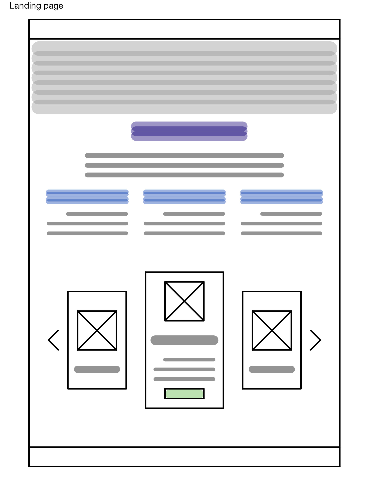
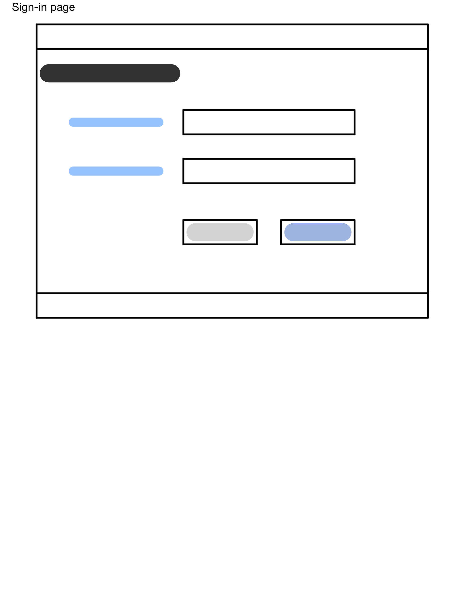
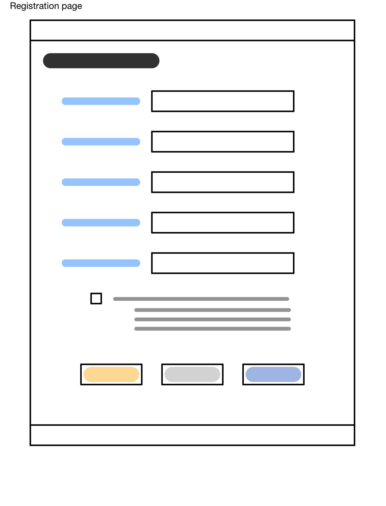
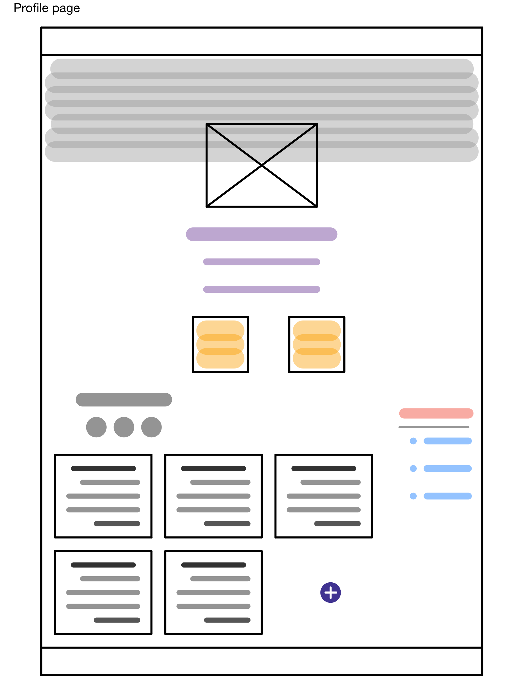
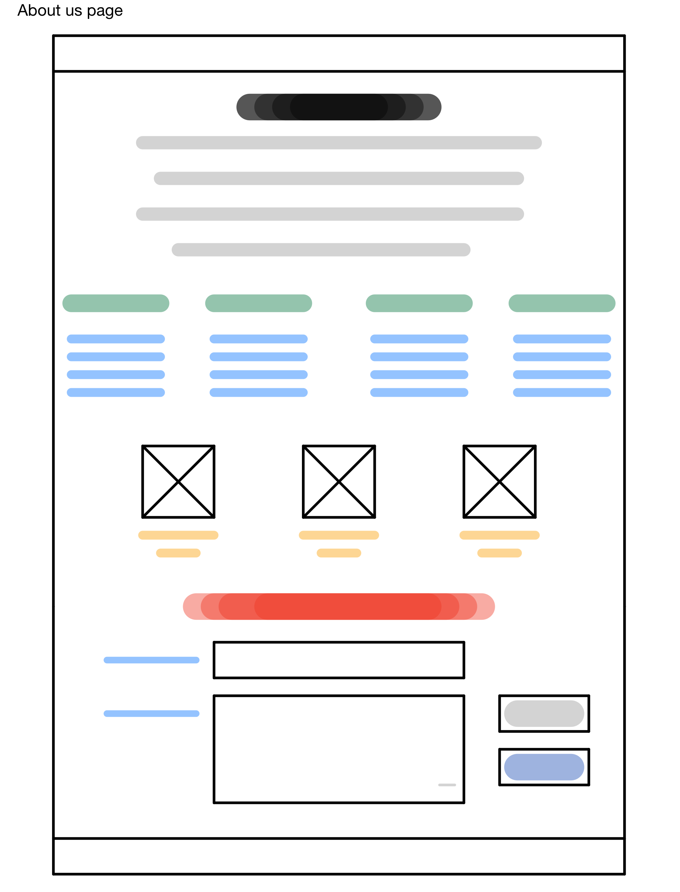

## INTRODUCTION

The talent platform is a fully functional web-based app build to help talented people to be involved and to be known in the _ENTERTAINMENT_ sector.
----

## WIREFRAMES

----

## USER EXPERIENCE

* The user can:
    * Register, log in and log out.
    * Show other users' profiles and comments.
    * Post comments.
    * Update belonged profile.
    * Update belonged comments.

* Uppon registration the user can choose to be **BUYER** or **SELLER**.
    * As a buyer user can:
        - Post an offer.
        - Update and delete belonged offer if not declined.
        - Check belonged offers status.
        - Show belonged offers history.
        - Make payment
    * As a seller user can:
        - Post and manage services.
        - Receive offers.
        - Accept and decline offers.

----
## List of used technologies
- Cup of coffee.
- Laptops.
- VS Code.
- HTML, CSS, and JS.
- Ruby on Rails.
- React.
- Material UI.
- Google Chrome.
----
## DEMONSTRATION
----
## FINALLY
we like to thank MiSK Academy | GA for giving us the opportunity to learn under this atmosphere which will never be the same without a INSTRUCTORS like you. Thank you for being our inspiration!
* Mr. Saad Iqbal.
    - Thank you for everything we appreciate all your effort and congratulation for your baby.
* Ms. Samar Faris.
    - No words can describe you thank you ASHKAL SHAY.
* Mr. Abdullah Al-Towaim
    - Thank you for your patience on us.
* Ms. Sara Daghustani
    - OMG what we can say ..!? THANK YOU **QUINTILLION**.
----
## AUTHORS
</> ♥ by Team Nardin
- Mohammad Al-Mahdawy.
- Abdurrahman Al-Sulami.
- Bandar Al-Huthaly.
- Faisal Al-Sulaimani.
